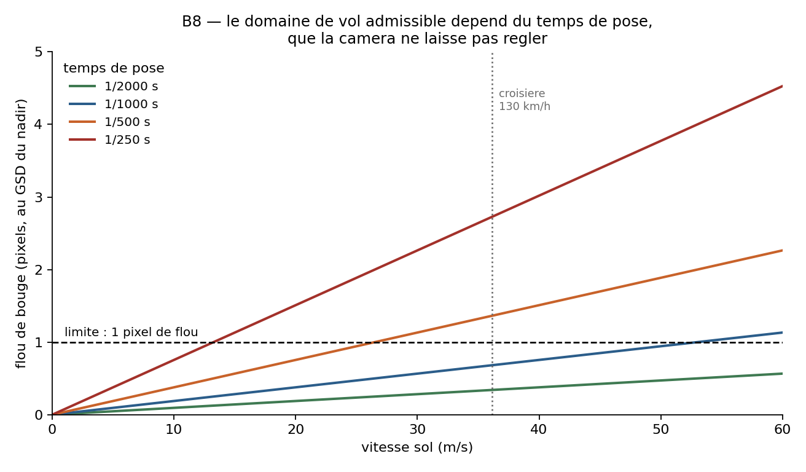

# Annexes — formules et protocoles reproductibles

**Language / Langue :** 🇬🇧 [English](annexes.en.md) · 🇫🇷 Français

Retour au [document principal](methode.md).

---

# Annexe A — Formules

La numérotation des formules est celle du document d'origine.

## A.4 Obturateur déroulant

**(A.15) Déplacement pendant la lecture du capteur**

$$d_{\text{lecture}} = v \times t_{\text{lecture}}$$

C'est la grandeur qui décide de l'admissibilité d'une caméra à un domaine de vol. Rapportée au GSD, elle donne directement la déformation en pixels.

**(A.16) Déformation exprimée en pixels**

$$\delta_{\text{px}} = \frac{d_{\text{lecture}}}{\text{GSD}}$$

Exemple du corps : à 36,1 m·s⁻¹ et pour un temps de lecture de 30 ms, le déplacement atteint 1,08 m, soit environ 20 pixels pour un GSD de 53 mm au nadir.

**(A.17) Mesure du temps de lecture par diode clignotante**

$$t_{\text{lecture}} = \frac{N}{f} \qquad\text{et}\qquad t_{\text{ligne}} = \frac{N}{f \cdot H}$$

où *f* est la fréquence de la diode, *N* le nombre de bandes comptées sur la hauteur de l'image et *H* la hauteur de l'image en lignes. Le protocole complet, avec ses conditions de validité, est en annexe B.

## A.5 Projection, résolution et flou

**(A.18) Projection rectilinéaire**

$$r = f \cdot \tan\theta$$

Cette relation diverge lorsque θ approche 90° : une projection rectilinéaire ne peut pas couvrir un champ très large, ce qui est précisément la raison pour laquelle un objectif de caméra d'action suit une autre géométrie.

**(A.19) Variation du GSD dans une projection équidistante**

$$\text{GSD}(\theta) \propto \frac{1}{\cos^2\theta}$$

Le GSD n'est donc pas uniforme dans l'image. Le demi-champ correspondant à un rapport de GSD donné se retrouve par inversion :

**(A.20) Demi-champ correspondant à un rapport de GSD**

$$\theta = \arccos\sqrt{\frac{\text{GSD}_{\text{nadir}}}{\text{GSD}_{\text{bord}}}}$$

Appliqué aux deux valeurs du § 3.4.4, 53 mm au nadir et 232 mm au bord, cela donne un demi-champ d'environ 61,4°, cohérent avec le modèle équidistant.

**(A.21) Flou de bougé en pixels**

$$B_{\text{px}} = \frac{v \times t_{\text{pose}}}{\text{GSD}}$$

Au-delà d'un pixel, le détail suggéré par le GSD n'est plus présent dans l'image : le GSD devient une borne supérieure de la résolution réelle, et non sa valeur.

**Figure A.1 — Flou de bougé en fonction de la vitesse et du temps de pose,** par application de l'expression (A.21). La ligne horizontale à un pixel marque le seuil au-delà duquel le déplacement pendant la pose commence à effacer le détail que le GSD laisse espérer.

## A.6 Valeurs numériques des paramètres

Les valeurs ci-dessous alimentent les formules précédentes. La colonne « statut » distingue ce qui a été mesuré, ce qui est repris d'une source et ce qui reste à établir.

| Temps de lecture | Déplacement pendant la lecture | Statut |
|---|---|---|
| 30 ms | 1,08 m | Rapporté, par analogie avec une HERO4 Black |
| 25 ms | 0,90 m | Constante encore présente dans la chaîne logicielle |
| **26,82 ms** | **0,97 m** | **Mesuré au banc sur la HERO4 Silver, ± 0,02 ms — valeur de référence** |

**Tableau A.2 — Temps de lecture : la valeur mesurée au banc et les constantes encore présentes dans la chaîne logicielle,** avec le déplacement associé à 130 km/h. Aucune des deux constantes ne correspond à la mesure.

| Position dans l'image | GSD calculé |
|---|---|
| Au nadir, au centre de l'image | 53 mm |
| Au bord du champ | 232 mm |

**Tableau A.3 — GSD calculé au centre et au bord du champ** pour la configuration de référence, à l'appui de la formule (A.19).

| Temps de pose | Déplacement pendant la pose | Flou au nadir |
|---|---|---|
| 1/2000 s | 18 mm | 0,3 pixel |
| 1/1000 s | 36 mm | 0,7 pixel |
| 1/500 s | 72 mm | 1,4 pixel |
| 1/250 s | 144 mm | 2,7 pixels |

**Tableau A.4 — Flou de bougé en fonction du temps de pose,** à 36,1 m·s⁻¹ et pour un GSD de 53 mm au nadir, par application de la formule (A.21).

---

# Annexe B — Protocoles de mesure reproductibles

Le document rapporte des mesures ; cette annexe dit comment les refaire. Elle s'adresse à un lecteur qui voudrait reproduire la caractérisation d'une caméra d'action, ou l'appliquer à un autre modèle que ceux étudiés ici. Elle donne les conditions de validité de chaque mesure, et les conditions dans lesquelles elle échoue — ce second point ayant coûté plusieurs séries inexploitables.

## B.1 Banc de mesure du temps de lecture

Le principe est celui de la formule (A.17). Une diode alimentée en créneau à fréquence connue est photographiée ; chaque ligne du capteur étant lue à un instant différent, l'image porte des bandes horizontales dont la périodicité donne le temps de lecture.

**Montage.** Une carte Arduino UNO R3 et une diode montées sur platine d'essai, la diode alimentée par une broche via une résistance de 220 Ω. Le créneau est produit par programmation directe du compteur 16 bits, et non par les fonctions de haut niveau de l'environnement Arduino : celles-ci n'offrent que des fréquences imposées ou arrondies sans avertissement. La valeur à charger dans le registre de comparaison vaut, pour un prédiviseur de 8 :

**(B.1) Registre de comparaison du compteur**

$$\text{OCR1A} = \frac{16\,000\,000}{2 \times 8 \times f} - 1$$

Les fréquences de 100, 200, 250, 500 et 1000 Hz tombent juste et ne subissent aucun arrondi. L'exactitude est celle du résonateur céramique de la carte, soit environ 0,5 % : elle se répercute intégralement sur le temps de lecture, ce qui interdit d'annoncer plus de deux chiffres significatifs.

Une source plus exacte existe et ne coûte rien : une lampe à diode alimentée sur le secteur clignote à exactement 100 Hz, le double de la fréquence du réseau, régulée à mieux que 0,1 %. Elle est de surcroît assez lumineuse pour éclairer une paroi, ce qu'une diode de platine ne fait pas. Le protocole recommandé emploie les deux sources : le nombre de bandes doit doubler entre 100 Hz et 200 Hz, et les deux temps de lecture doivent concorder. C'est le seul contrôle croisé qui vaille.

### B.1.1 Les conditions sans lesquelles la mesure ne donne rien

Trois séries ont été acquises avant d'obtenir des images exploitables. Les causes d'échec sont rapportées ici parce qu'elles ne sont pas évidentes et qu'elles se reproduiront chez quiconque refera la mesure.

**La source qui clignote doit être la seule lumière de la scène.** Photographiée en plein jour, une diode n'est qu'un objet blanc éclairé par le soleil : sa modulation est noyée et aucune bande n'apparaît, quelle que soit la qualité de l'analyse.

**Le temps de pose doit être court devant la période de la diode**, de l'ordre du tiers. Si une ligne intègre plusieurs cycles complets, elle n'en voit que la moyenne et les bandes s'effacent. À 100 Hz il faut donc descendre à 1/300 s, à 500 Hz à 1/1500 s.

Ces deux exigences s'opposent : l'obscurité allonge la pose. C'est l'arbitrage central du banc, et il se règle en baissant la fréquence de la diode plutôt qu'en cherchant une pose plus courte.

| Fréquence de la diode | Pose maximale utile | Bandes attendues sur la hauteur |
|---|---|---|
| 100 Hz | 1/300 s | 0,5 à 3 |
| 200 Hz | 1/600 s | 1 à 6 |
| 500 Hz | 1/1500 s | 2,5 à 15 |
| 1000 Hz | 1/3000 s | 5 à 30 |

**Tableau B.1 — Arbitrage entre la fréquence de la diode et le temps de pose atteignable.** Le nombre de bandes attendu vaut le produit du temps de lecture par la fréquence, pour un temps de lecture compris entre 5 et 30 ms.

Sur toute la gamme HERO, le temps de pose ne se fixe pas en mode photo : le réglage n'existe qu'en vidéo et en pose longue. Le levier y est donc indirect — bloquer le plafond de sensibilité au minimum et sous-exposer, de sorte que l'appareil n'ait plus qu'une variable libre et raccourcisse la pose de lui-même. Sur un boîtier sans réglage manuel, seule l'intensité de l'éclairement agit.

La gamme MISSION fait exception, et cela change la nature de la mesure. Son manuel utilisateur indique que l'obturateur se règle « en modes Vidéo et Photo » et propose trois positions : Auto, Fixe — pour verrouiller l'obturateur — ou Plage. La sensibilité se verrouille de la même façon. Sur ces boîtiers, le banc ne dépend donc plus de l'éclairement : on impose la pose, on impose la sensibilité, et la fréquence de la diode redevient la seule variable. Cette capacité a une portée qui dépasse le banc, puisqu'elle fait du flou de bougé — quatrième défaut du tableau 3.1 — un paramètre maîtrisé plutôt qu'une contrainte subie.

### B.1.2 Les trois contrôles qui distinguent une mesure d'un artefact

Un spectre possède toujours un maximum. Le prendre pour une bande est l'erreur à éviter, et trois vérifications suffisent à l'écarter.

**La raie ne doit pas dépendre du traitement.** Si l'analyse retire au profil une moyenne glissante de largeur *k*, le maximum du spectre tombe mécaniquement vers *H/k* cycles, le contenu naturel d'une image décroissant en 1/*f*. Relancer l'analyse avec deux valeurs de *k* : si le pic suit *k*, il appartient au filtre.

**La raie ne doit pas dépendre de la résolution.** Le nombre de cycles par image est indépendant de l'échelle : analyser la même photographie en pleine résolution puis réduite de moitié doit donner le même nombre.

**La raie doit être en phase sur toute la largeur.** Une bande d'obturateur déroulant traverse le capteur au même instant ; l'écart de phase entre le profil de la moitié gauche et celui de la moitié droite doit rester sous 0,3 radian.

Un garde-fou dimensionnel complète ces contrôles. Le nombre de cycles attendu vaut le produit du temps de lecture par la fréquence de la diode : pour un temps de lecture de 5 à 30 ms et une diode entre 100 et 1000 Hz, il tient entre 0,5 et 30 cycles par image. Toute raie située à plusieurs centaines de cycles est un artefact du capteur ou de l'encodage.

| Boîtier | Hauteur d'image | Raie parasite constatée | Période | Origine |
|---|---|---|---|---|
| GoPro HERO4 Silver | 3000 lignes | 1500 cycles | 2,000 lignes | bruit ligne paire/impaire |
| GoPro HERO (2018) | 2736 lignes | 750 cycles | 3,648 lignes | motif de lecture du capteur |

**Tableau B.2 — Raies parasites identifiées sur des clichés pris hors de tout montage de banc.** Elles ne dépendent d'aucune source extérieure et doivent être exclues d'office de la recherche de bandes.

### B.1.3 Deux pièges rencontrés au dépouillement

Un créneau ne porte pas qu'une fréquence : il porte aussi ses harmoniques impaires. Selon le temps de pose, la troisième peut dépasser la fondamentale dans le spectre, et retenir simplement le maximum triple alors le résultat. Le cas s'est présenté sur la cadence de 1000 microsecondes, où l'analyse lisait 40,25 cycles quand la fondamentale se trouvait à 13,42 — exactement le triple. La parade consiste à redescendre la famille : partir du maximum, le diviser par trois, cinq, sept ou deux, et recommencer tant que le quotient porte lui aussi une raie franche.

Certaines cadences sont par ailleurs muettes par construction, et ce n'est pas un échec de manipulation. Le contraste des bandes décroît comme le sinus cardinal du rapport entre le temps de pose et la période de la diode, et il s'annule exactement lorsque la pose couvre un nombre entier de périodes. Sur la HERO (2018), dont la pose s'est fixée à dix millisecondes, les cadences de 1000 et 250 microsecondes correspondent à cinq et vingt périodes tout juste : elles n'ont donné aucune bande, quand les cadences voisines en donnaient. Loin d'infirmer la mesure, cette coïncidence la confirme, puisqu'elle était prévisible à partir de la seule pose lue dans les métadonnées.

Une photographie aberrante suffit enfin à emporter une cadence entière. La première image d'une série, prise pendant que l'opérateur cadre encore, peut donner un comptage sans rapport avec les autres ; le rejet se fait sur l'écart à la médiane du lot, et non sur la moyenne, qu'une seule valeur extrême déplace.

## B.2 Réglages de capture selon le modèle de caméra

Le paramétrage conditionne la faisabilité de la mesure autant que le montage. Le tableau ci-dessous donne, pour les familles de boîtiers susceptibles d'être employées, ce qui est réglable et ce qui ne l'est pas. **La colonne « réglages manuels » désigne la sensibilité et la correction d'exposition : sauf sur la gamme MISSION, l'obturateur ne se fixe jamais en mode photo.**

| Famille de boîtier | Réglages manuels en photo | Sensibilité | Levier disponible |
|---|---|---|---|
| HERO3 / 3+ Silver, HERO (2018), HERO7 White et Silver, Session | aucun | — | éclairement seul |
| HERO4 Silver et Black | partiels, obturateur exclu | minimum à relever à 800, le maximum offert | plafond ISO et correction d'exposition |
| HERO5, HERO6, HERO7 Black | oui, obturateur exclu | minimum et plafond à relever ensemble | idem, plus capture brute |
| HERO8 à HERO13, MAX | oui, obturateur exclu | minimum et plafond à relever ensemble | idem ; couper impérativement la fusion multi-image |
| MISSION 1, MISSION 1 PRO ILS | oui, **obturateur compris** | Auto, Fixe ou Plage | pose et sensibilité verrouillables : le banc ne dépend plus de l'éclairement |

**Tableau B.3 — Ce qui est réglable selon la génération de boîtier.** Sur les générations récentes, le traitement multi-image activé par défaut fusionne plusieurs lectures du capteur et détruit la structure recherchée.

Deux réglages commandent tout le reste, et ils sont l'un et l'autre contre-intuitifs. Le premier est le **mode photo simple**, une photographie à la fois : en rafale ou en intervallomètre, une HERO4 ne descend pas sous un trentième de seconde quoi qu'on règle, et aucun autre réglage ne sert tant que ce point n'est pas respecté. Le second est la **sensibilité minimale, qu'il faut relever à la valeur la plus haute offerte** — 800 sur une HERO4 — et non abaisser. À exposition égale l'appareil peut choisir 1/120 s à faible sensibilité ou 1/560 s à sensibilité élevée ; il préfère spontanément la première, la seule qui ne serve à rien ici. Lui interdire de descendre ne lui laisse que l'obturateur pour compenser. Deux leviers s'y ajoutent : la mesure spot, sans laquelle l'appareil expose pour la pièce noire, et un diffuseur large plutôt qu'un point vif, la mesure spot faisant une moyenne sur sa zone — c'est la surface éclairée qui commande, non la luminance.

Après chaque série, la vérification passe par les métadonnées des fichiers : le temps de pose réellement appliqué n'est lisible nulle part ailleurs. Trois grandeurs s'y lisent — la pose la plus courte obtenue, la sensibilité, **qui doit être au minimum forcé, soit 800 sur une HERO4**, et la hauteur de l'image en pixels, qui est le *H* de la formule (A.17) et change avec la résolution choisie.

## B.3 Matériel du banc

| Élément | Référence | Remarque |
|---|---|---|
| Carte programmable | GoTronic UNO R3, kit GT012 référence 35110 | Résonateur céramique : exactitude de fréquence d'environ 0,5 %, qui se reporte intégralement sur le temps de lecture. |
| Diode | fournie dans le même kit | Montée sur platine d'essai, en série avec une résistance de 220 Ω. |
| Source de référence | lampe à diode secteur non dimmable | Clignote à exactement 100 Hz ; plus exacte que la carte, et assez lumineuse pour éclairer une paroi. |

**Tableau B.4 — Matériel du banc de mesure du temps de lecture.**

## B.4 Vol de validation

Le protocole minimal à documenter pour qu'une validation photogrammétrique soit recevable comprend les éléments suivants, dont l'absence a été constatée dans plusieurs comptes rendus consultés.

- **Le bloc d'images** : nombre de clichés, recouvrement longitudinal et latéral effectifs, hauteur de vol et vitesse sol.
- **Les points d'appui et les points de contrôle, distingués** : une erreur calculée sur des points ayant servi à l'ajustement ne mesure pas l'exactitude du résultat.
- **Le modèle de projection déclaré**, et la valeur de temps de lecture renseignée si la chaîne en accepte une.
- **La convergence de l'ajustement et l'erreur de reprojection**, rapportées avec le nombre de points homologues retenus.

## B.5 Synchronisation de l'horloge de la caméra

L'appariement des clichés à la trajectoire repose entièrement sur l'horodatage. À 12 m·s⁻¹, une seconde d'erreur déplace la photographie de douze mètres au sol, et rien ne le signale pendant le vol. L'écart entre l'horloge de la caméra et le temps du récepteur dérive : il doit être mesuré le matin même, et non supposé stable d'un vol à l'autre.

Deux mesures sont possibles et ne se remplacent pas. La première interroge l'état publié par la caméra : elle est immédiate mais ne descend pas sous la seconde. La seconde apparie l'heure inscrite dans les métadonnées de plusieurs clichés avec celle du récepteur : elle descend sous la seconde et constitue la référence. La caméra n'accepte pas les fractions de seconde en réglage : un écart résiduel subsiste toujours et doit être reporté, non corrigé à l'aveugle.

## B.6 Résultats du banc : les campagnes de septembre 2026

Sept séances ont été conduites sur deux boîtiers, avec le même montage et le même dépouillement. La carte balayait seule ses quatre cadences — des états de 2 000, 1 000, 600 et 250 microsecondes — et l'attribution des cadences a été retrouvée après coup, sans être supposée. La colonne « accord » donne l'écart entre les temps de lecture obtenus sous ces quatre cadences : c'est lui qui fait la preuve, et non la valeur, puisque le temps de lecture est une propriété du capteur et ne peut pas dépendre de la source lumineuse.

| Boîtier | Champ | Définition | Photos | ISO minimum | Temps de lecture | Accord |
|---|---|---|---|---|---|---|
| GoPro HERO4 Silver | large | 12 Mpx | 121 | 800 | 27,01 ms | 1,17 % |
| GoPro HERO4 Silver | large | 7 Mpx | 109 | 800 | 26,86 ms | 1,40 % |
| GoPro HERO4 Silver | moyen | 7 Mpx | 125 | 800 | 18,29 ms | 0,74 % |
| GoPro HERO4 Silver | moyen | 7 Mpx | 249 | 800 | 18,29 ms | 2,90 % |
| GoPro HERO13 Black | Wide | 27 Mpx | 229 | automatique | 20,73 ms | 3,80 % |
| GoPro HERO13 Black | Linear | 27 Mpx | 59 | automatique | 20,80 ms | 5,40 % |
| GoPro HERO13 Black | Linear | 27 Mpx | 66 | **800** | 20,96 ms | **0,80 %** |

**Tableau B.5 — Temps de lecture mesurés au banc en septembre 2026.** Le champ moyen de la HERO4 Silver n'est proposé qu'en 7 Mpx ; la séance en champ large à 7 Mpx a été conduite pour séparer l'effet du champ de celui de la définition. Mesures de l'auteur.

**La dernière ligne démontre le levier de la sensibilité.** À configuration identique — HERO13 Black, champ Linear, 27 Mpx —, forcer la sensibilité minimale à 800 fait passer l'accord entre cadences de 5,40 % à 0,80 %, soit près de sept fois mieux. C'est la vérification expérimentale du réglage présenté comme décisif en B.2, et elle ne tient pas au nombre de photographies, la séance la plus fournie des deux étant la moins bonne.

Trois résultats s'en dégagent. Le premier est que **le temps de lecture suit le champ employé à la prise de vue, et non la définition du fichier** : le champ large donne 27,01 ms en 12 Mpx et 26,86 ms en 7 Mpx, soit un demi pour cent d'écart, alors que le champ moyen donne 18,29 ms. C'est cohérent avec le fonctionnement d'un capteur à obturateur déroulant — le champ décide de la portion réellement lue, la définition n'étant qu'un sous-échantillonnage appliqué après la lecture. Sans la séance en champ large à 7 Mpx, les deux causes restaient confondues.

Le deuxième est que le champ moyen lit environ **68 %** de la hauteur du capteur, rapport des deux temps de lecture. Le troisième est que la valeur du champ moyen a été reproduite à la deuxième décimale par deux séances indépendantes, de 125 et 249 photographies, **conduites deux jours de suite**.

La conséquence pratique tient en une ligne : la valeur à déclarer au logiciel de photogrammétrie dépend du champ employé et de rien d'autre — **18 ms en champ moyen et 27 ms en champ large pour la HERO4 Silver, 21 ms pour la HERO13 Black quel que soit son objectif numérique.**
