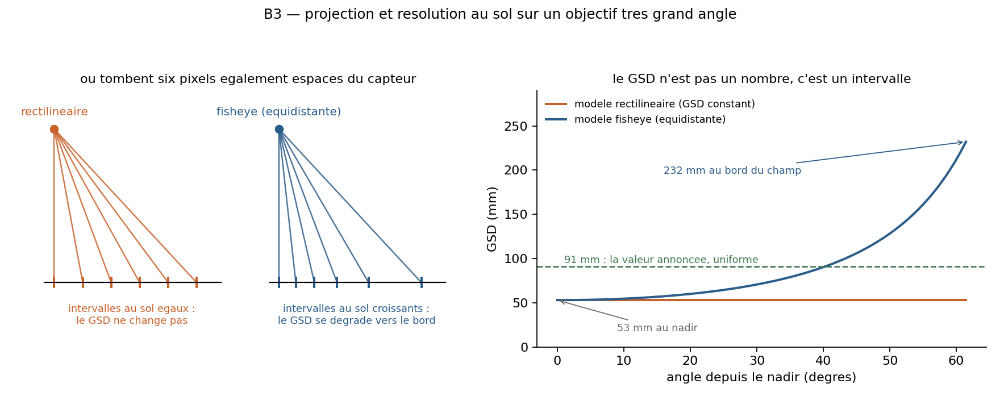
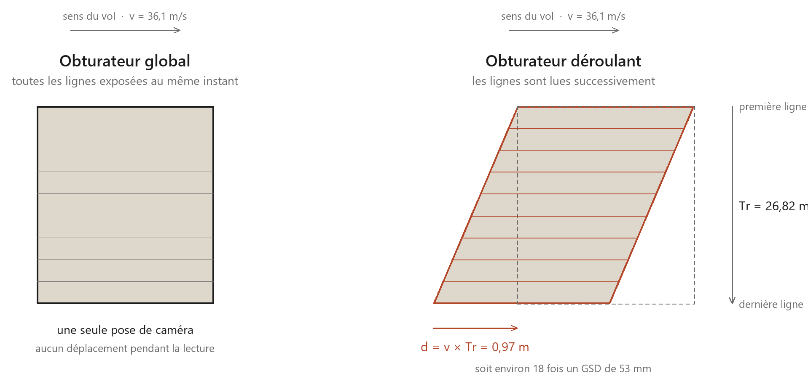
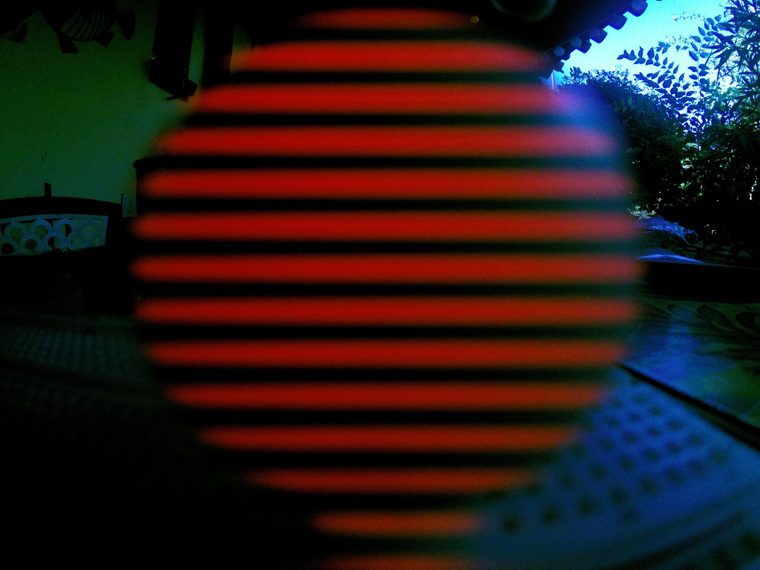
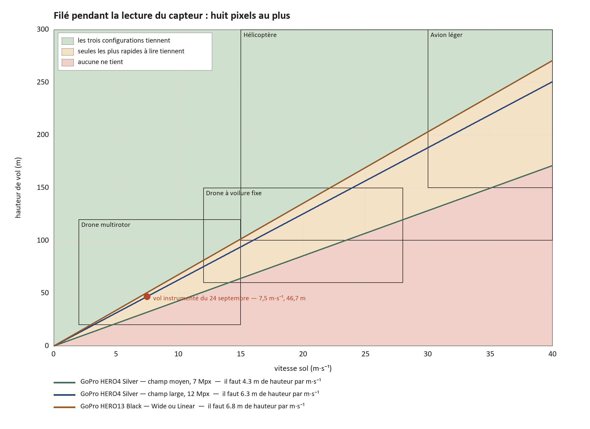
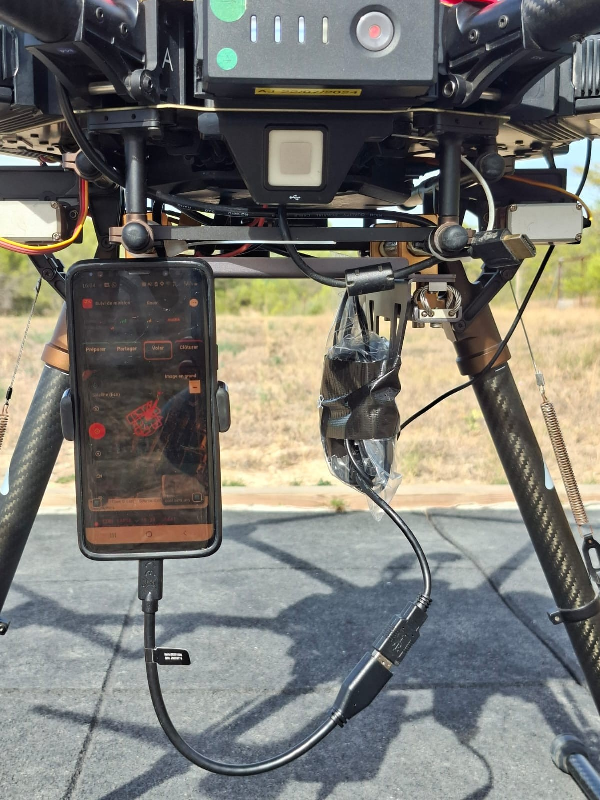
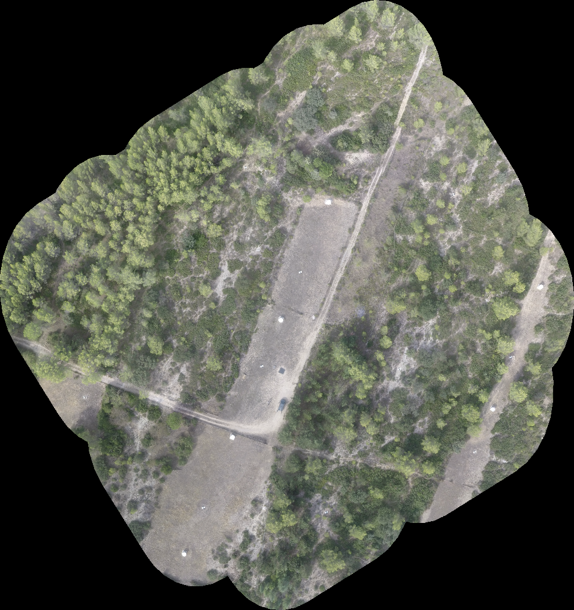
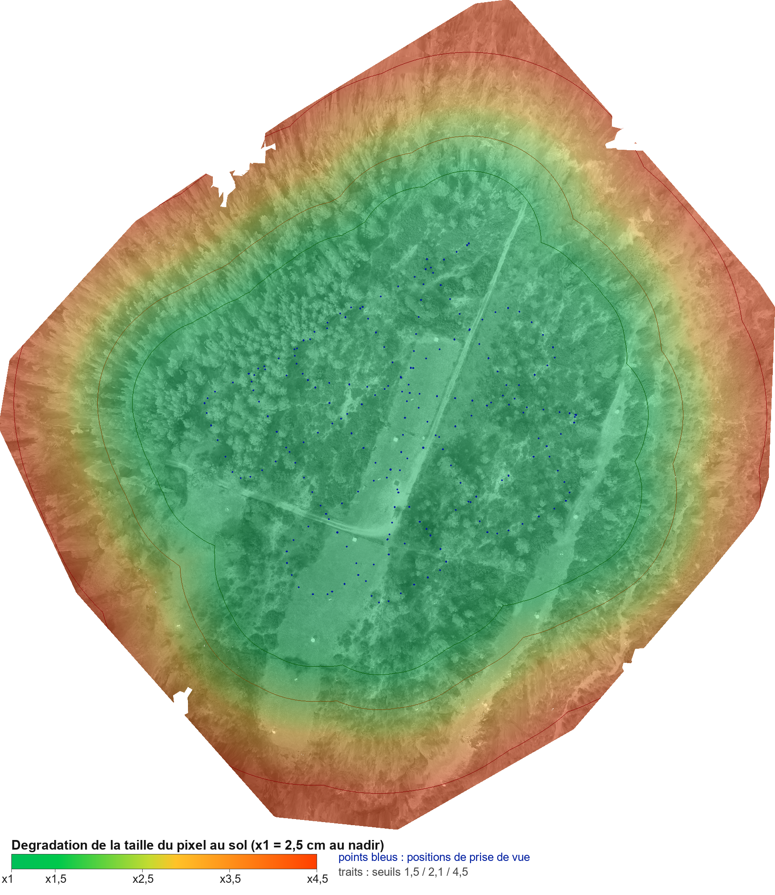
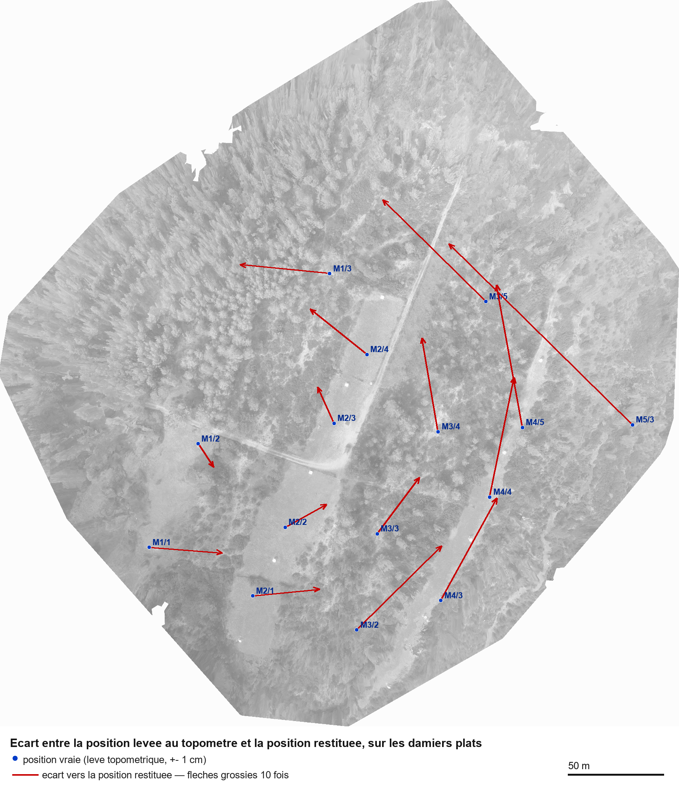
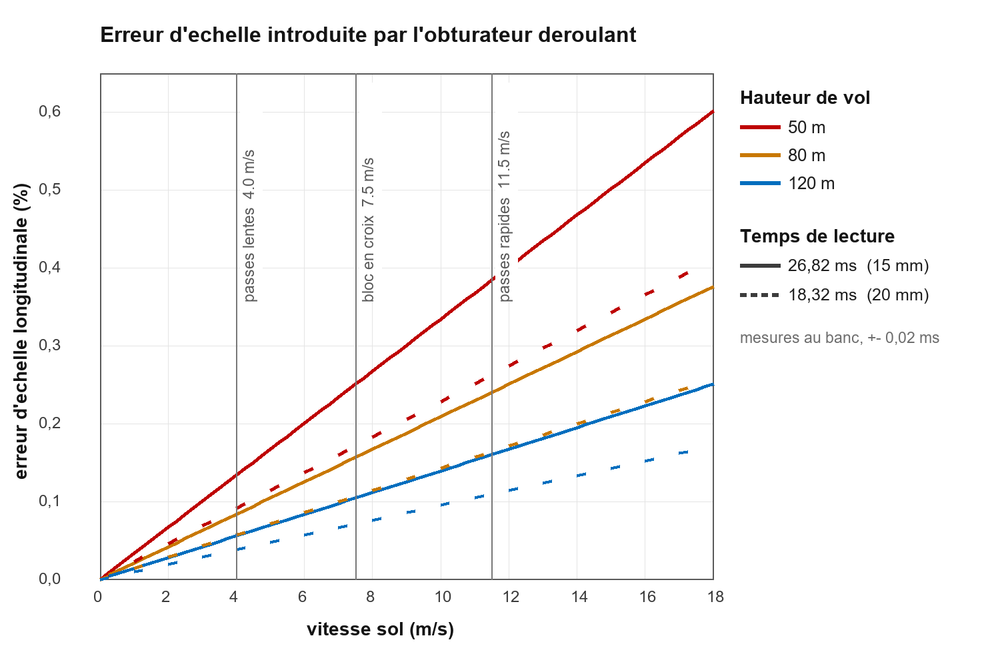

# Can an action camera produce a usable orthophoto?

**Language / Langue :** 🇬🇧 English · 🇫🇷 [Français](methode.md)

An action camera costs a few hundred euros. A metric camera intended for aerial photography can represent an investment of several tens of thousands, to which the lens and the integration into the aircraft must be added. That gap is not only a matter of resolution or apparent image quality: it is a matter of geometric guarantees that the action camera does not offer out of the box.

The question asked here is therefore narrow, and it is technical: **can a GoPro acquire an image block from which an orthophoto can be produced, and under what conditions?**

The answer cannot be deduced from the choice of body. It depends on the capture mode, the optics, the viewing geometry, the platform's speed and the processing. This work examines these conditions one by one, measures those that can be measured — in particular the sensor readout time, which public databases do not provide for these bodies — and confronts the result with an instrumented flight.

The aim is not a topographic survey of centimetric precision. It is to find out whether a lightweight set-up can provide georeferenced images and, when acquisition conditions allow, an orthophoto whose sharpness and geometric consistency suffice to document what was overflown.

> **Figure and table numbering is that of the source document.**
> Figures 3.6 and 3.7 do not appear here: they showed software interfaces unrelated to the question addressed. Their numbers are left vacant rather than reassigned.

---

## 3.4.2 Five weaknesses to control

The literature on photogrammetry with action cameras remains narrower than that dealing with metric cameras or sensors designed for mapping. Two studies bear directly on the question: one assesses the geometric quality of wide-angle action cameras used in drone photogrammetry; the other examines the precision and modelling of the rolling shutter.

| Weakness | Nature | Consequence for the orthophoto | Possible response |
|---|---|---|---|
| Wide-angle distortion | Geometric | Non-pinhole projection and apparent curvature | Calibration and fisheye model |
| Rolling shutter | Geometric and dynamic | Image lines acquired at different instants | Readout-time measurement and correction |
| Instability of interior orientation | Geometric | Calibration parameters potentially variable | Monitoring and recalibration |
| Motion blur | Loss of information | Degraded image matching | Reduce movement during exposure |
| JPEG compression | Radiometric loss | Fine detail and texture altered | Limit it, without being able to undo the loss |

**Table 3.1 — Principal photogrammetric limitations of an action camera.** Synthesis from Hastedt, Ekkel and Lühmann (2016), Vautherin et al. (2016), Kannala and Brandt (2006) and Zhou et al. (2019), completed by the trials conducted here.

These weaknesses do not all call for the same response. Some geometric effects can be accounted for in the photogrammetric model, provided their parameters are known or can be estimated: this is the case for lens distortion and, under certain conditions, for rolling-shutter deformation. Motion blur and lossy JPEG compression, by contrast, degrade the detail recorded. Processing can sometimes improve an image's appearance, but it does not guarantee faithful restitution of the detail needed for measurement. These degradations must therefore be limited at acquisition, notably by controlling exposure and camera movement; image overlap can help the processing, without repairing a blurred or over-compressed photograph.

## 3.4.3 From the HERO4 Silver to the MISSION 1 PRO ILS: three camera configurations

The GoPro HERO4 Silver served for the trials because it was available, without being adopted on principle as the final configuration. In one-second Time Lapse photo mode its measured readout time is 26.9 ms; this configuration was validated within the envelope tested on a multirotor drone. In single-photo mode, medium field at 7 MP, the measured time falls to 18.3 ms, but this second configuration was not the subject of an instrumented flight. The HERO13 Black was also measured on the bench: 20.8 ms in Wide as in Linear photo mode, with no instrumented flight. These results characterise precise capture modes and do not, on their own, support a conclusion for a light aircraft. The protocol and the conditions of the trials are detailed in the [annexes](annexes.en.md).

The MISSION 1 PRO ILS is the configuration envisaged for what follows. Its Micro Four Thirds mount allows a lens to be chosen according to flight height, swath and the GSD sought. It has no electronic contacts, however: the lens must allow focus and aperture settings compatible with that constraint. The body–lens pair will have to be calibrated. For want of an evaluation unit, neither its readout time nor its photogrammetric performance was measured here.

| Item | HERO4 Silver | HERO13 Black | MISSION 1 PRO ILS |
|---|---|---|---|
| Role | Camera used for the trials | Intermediate comparison | Configuration envisaged, untested |
| Photographs | 12 MP | 27 MP | 1.0-inch type sensor, 50 MP |
| Optics | Fixed wide-angle | Fixed lens, Wide and Linear fields | Micro Four Thirds mount; compatible manual lens to be chosen |
| Readout time | 26.9 ms in the mode tested | 20.8 ms in Wide and Linear | Not measured |
| State of validation in this work | Bench measurement | Bench measurement, no photogrammetric trial | Neither bench measurement nor photogrammetric trial |

**Table 3.2 — Characteristics and state of validation of the three cameras studied.** Bench measurements do not amount to photogrammetric validation. Sources: GoPro and author.

## 3.4.4 Distortion

Images produced by a very wide-angle lens cannot always be correctly described by a simple rectilinear model. Their photogrammetric use requires a suitable camera model and a calibration. Figure 3.2 illustrates the consequence for planning: in the fisheye model adopted, the ground pixel size increases from the centre towards the edges of the image. For the configuration shown, it is computed at 53 mm at nadir and 232 mm at the edge of the field. These values depend on the viewing assumptions; they are not a measurement of an orthophoto's resolution.

The choice of optics therefore counts as much as the sensor's pixel count. Casella et al. studied, for drone mapping of beaches, a HERO4 Silver with a fisheye lens and a HERO4 Black fitted with a modified lens. Their comparison highlights the interest of examining a less wide-angle optic, without prejudging the performance of whichever lens would finally be fitted.

**Figure 3.2 — Rectilinear projection and fisheye model: GSD varies across the field.** The values 53 mm and 232 mm are computed for the configuration shown, not measured on an orthophoto. Author's calculations.

## 3.4.5 The rolling shutter

The rolling shutter does not principally produce blur. It introduces a geometric deformation when the camera or the scene moves during the reading of the sensor. Unlike a global shutter, which exposes the whole sensor at the same instant, a rolling-shutter sensor reads the image lines one after another. The top and the bottom of a single photograph therefore correspond to slightly different instants.

This difference becomes important for an airborne camera. During the readout the aircraft moves and may also rotate. The effect depends notably on the readout time, the ground speed, angular motion, altitude, camera orientation and the projection model used.

To a first approximation, the platform's displacement during readout is written:

$$d = v \times T_r$$

where *d* is the displacement during readout, *v* the ground speed and *Tr* the sensor readout time. This distance is not directly a photogrammetric error on the ground: the final effect also depends on the viewing geometry, the aircraft's rotations, the overlap and the photogrammetric processing. It nonetheless provides a simple indicator for comparing camera and mission configurations.

For the GoPro HERO4 Silver used here, the readout time measured on the bench is 26.82 ms in the mode studied. By way of example, at a speed of 36.1 m/s, i.e. 130 km/h, the platform moves during that readout by:

$$d = 36.1 \times 0.02682 \approx 0.97\ \text{m}$$

Referred to the GSD computed at nadir, equal to 53 mm in the configuration shown, that displacement corresponds to about 18 pixels. This number does not mean that the orthophoto will mechanically carry an 18-pixel error: it is an indicator of displacement during readout, before the full geometry and the processing are taken into account. It does show, however, that readout time can become an important parameter for a camera used at high speed.

**Figure 3.3 — Simultaneous or successive reading of the sensor.** At 36.1 m/s, a 26.82 ms readout corresponds to 0.97 m of platform displacement; this distance is not the error measured on the orthophoto. Author's diagram and calculations.

The literature provides the framework for modelling this effect. Vautherin et al. (2016) study the influence of the rolling shutter on photogrammetric precision and show that camera motion can be integrated into the adjustment model. Their work includes trials with a GoPro HERO4 Black; that value must not, however, be equated without verification with the readout time of the HERO4 Silver used here.

Zhou et al. (2019) propose a two-stage method for correcting rolling-shutter deformation in a drone photogrammetry chain. Their contribution shows that an estimate can be made during processing when certain parameters are not perfectly known beforehand. It does not, however, replace measuring the body actually used: the bench measurement is here the starting point for the flight-envelope calculations.

The photogrammetric processing rests on **OpenDroneMap** (ODM). OpenDroneMap publishes, in its RSCalibration project, a method for measuring readout time, intended notably to supply the rolling-shutter correction parameters. The bench described here follows that approach: the value measured for the GoPro HERO4 Silver can be supplied to ODM at processing time, without waiting for its possible inclusion in the software's database. This articulation links the measurement of the body to the engine actually used; it does not, on its own, demonstrate the precision of the resulting orthophoto, which is assessed by the flight presented in section 3.5.

## 3.4.6 Measuring the readout time

The readout time needed to account for the rolling shutter depends on the camera and the capture mode. OpenDroneMap publishes, in its RSCalibration project, a protocol for measuring this parameter and supplying it to the software. In the ODM database consulted for this work, neither the HERO4 Silver nor the HERO13 Black has a value on record; borrowing the HERO4 Black's for the Silver would amount to assuming that their sensors and read-out modes behave in the same way. That is why the configurations used or envisaged were put on the bench.

The principle is to photograph an LED whose flashing rate is set. Since the sensor's lines are read one after another, they record different states of the LED: the bands visible in the image allow the time separating the reading of the first line from that of the last to be estimated. The detailed protocol, the photographs retained and the uncertainty calculation are given in [annexe B](annexes.en.md).

**Figure 3.4 — LED bench for measuring the readout time of the HERO4 Silver.** The light bands give the time offset between the sensor's lines; detailed protocol in annexe B. Author's photograph.

| Camera | Capture mode | Readout time | Status |
|---|---|---|---|
| HERO4 Silver | Single photo, 4,000 × 3,000 | 26.82 ± 0.02 ms | Measured on the bench per the protocol described in the annexes |
| HERO4 Silver | Time Lapse photo, 1 s | 26.9 ms | Measured on the bench; mode used for the drone flight |
| HERO4 Silver | Single photo, medium field, 7 MP | 18.3 ms | Measured on the bench; no instrumented flight in this mode |
| HERO13 Black | Wide and Linear photo | 20.8 ms in both modes | Measured on the bench; no instrumented flight |

**Table 3.3 — Readout times obtained for the capture modes studied.** These are measurements from this work, not values taken from the ODM database. Uncertainties are given only where they were established and documented in the annexes.

The measurements show above all that a value must not be attributed to a camera's commercial name alone: on the HERO4 Silver, the medium field measured does not give the same readout time as the 4,000 × 3,000 photo mode. The table's values feed the flight-envelope calculations of the following section. Their actual use in ODM at processing time must itself be described from the parameters really recorded, rather than inferred from the mere existence of the measurements.

## 3.4.7 From readout time to the operating envelope

The rolling-shutter readout time links the camera's characteristics to mission conditions. At equal speed, a slower readout entails a greater displacement of the platform between the start and the end of the lines' exposure. At a given speed, the relative effect diminishes as flight height increases, because the GSD increases too.

Figure 3.5 translates this relationship into a speed–height envelope. The lines correspond to the conditions under which the computed smear stays below the adopted threshold of eight pixels. They are established from the readout time measured for each mode and the GSD used in the calculation. They are therefore indicative planning limits, not universal boundaries of photogrammetric compatibility.

The only configuration that was the subject of an instrumented flight is the GoPro HERO4 Silver in one-second Time Lapse photo mode, represented by the point corresponding to the flight of 24 September 2026. That flight validates the chain's operation under the conditions tested with a multirotor drone; it validates neither the HERO4 Silver's other modes nor the other platforms shown.

The other lines rest on readout times measured on the bench, but have not been validated by a complete photogrammetric flight. They must therefore be read as configurations to be tested. In particular, the HERO4 Silver in single-photo medium field, and the HERO13 Black in Wide or Linear mode, cannot be declared compatible on the basis of the computed smear in pixels alone.

**Figure 3.5 — Speed–height envelopes computed for three capture modes at the indicative threshold of eight pixels.** The point marks the only instrumented flight; the coloured bands do not validate the other aircraft. Author's calculations.

| Camera and mode | Readout time | Result of the calculation at the flight point | Validation available |
|---|---|---|---|
| GoPro HERO4 Silver, Time Lapse photo 1 s | 26.9 ms | Configuration assessed within the envelope of the flight performed | Photogrammetric flight performed with a multirotor drone |
| GoPro HERO4 Silver, single photo, medium field, 7 MP | 18.3 ms | About 5.5 pixels of computed displacement at the flight point | Readout time measured; no instrumented flight in this mode |
| GoPro HERO13 Black, Wide or Linear photo | 20.8 ms | About 8.7 pixels of computed displacement at the flight point | Readout time measured; no instrumented flight |

**Table 3.4 — Measured and computed results for the three configurations studied.** The readout times come from the measurement bench; the pixel counts correspond to a calculation under the conditions of the flight point shown on the figure. They are not a measurement of the orthophoto's final error. Experimental validation remains limited to the HERO4 Silver in one-second Time Lapse photo mode and to the multirotor drone used for the trial.

These envelopes are computed from the measured readout times. Their confrontation with a complete photogrammetric trial is presented below for a single configuration: the HERO4 Silver in one-second Time Lapse mode, carried by a multirotor drone.

---

# 3.5 Validation by drone flight

The flight envelope computed from the readout time is a hypothesis of compatibility. Only a complete trial — combining acquisition, overlap, georeferencing, processing and independent checking — can show what the chain really produces. An instrumented flight was therefore carried out with a GoPro HERO4 Silver, in one-second Time Lapse photo mode, on 24 September 2026.

The trial took place at a site used by YellowScan for calibration, with ground control points and LiDAR data acquired two days earlier. The set-up rested on a DJI Matrice 600 multirotor drone. The GoPro was rigidly fixed beneath the airframe, its long side oriented perpendicular to the flight axis.

The flight plan was exported in JSON format to UgCS, then made available in the DJI console. The photographs were subsequently processed with OpenDroneMap.

The main block, flown in a cross pattern, covered the area in 3 min 45 s and produced 226 exposures. Complementary passes were flown along a single axis and at a comparable height, at 4 then 11.5 m/s, in order to examine the sensitivity of the restitution to speed. The site consists of a pine canopy, tracks and firebreaks.

**Figure 3.8 — Mounting of the HERO4 Silver and the GNSS receiver on the trial drone.** This mounting does not validate installation on a manned aircraft. Author's photograph.

The main block was acquired at a mean ground height of 46.7 m and a mean ground speed of 7.5 m/s. The measured forward overlap is 90 %. The 55 % side overlap corresponds to the planning instruction; it was not measured independently. The images were processed with the camera model adopted and the rolling-shutter correction parameters provided by the chain.

**Figure 3.9 — Orthophoto from the HERO4 Silver drone flight, clipped to the adopted swath.** The output pixel size does not guarantee uniform fineness of detail. Source: author.

| Indicator | Value | Interpretation |
|---|---|---|
| Mean ground height | 46.7 m | Acquisition parameter |
| Mean ground speed | 7.5 m/s | Acquisition parameter |
| Forward overlap | 90 % | Measured on the images |
| Side overlap | 55 % | Planning instruction, not measured |
| Nominal GSD at nadir | 2.5 cm | Computed value |
| Mean GSD of the block | 2.7 cm | Computed value |
| Images aligned | 226 of 226 | A single block, no fragmentation |
| Tie points | 78,256 | Processing result |
| Dense cloud points | 18.5 million | Processing result |
| Mean reprojection error | 2.0 px | Internal check of the adjustment |
| Orthophoto area | 2.89 ha | Area actually produced |
| Planimetric deviation before registration | 4.5 m on average | Absolute accuracy estimated on the targets |
| Planimetric deviation after registration | 0.49 m | Residual after similarity transformation |
| Vertical error | RMSE 5.11 m; bias −3.79 m | Estimated altimetric accuracy |

**Table 3.5 — Results of the HERO4 Silver drone flight.** The residual after registration on targets does not measure the operational accuracy obtained without those targets. Author's measurements and processing.

The processing aligned the 226 images into a single block. This absence of fragmentation is notable given the repetitive texture of the forest canopy. It produced 78,256 tie points, a dense cloud of 18.5 million points and a 2.89 ha orthophoto at an output resolution of 5 cm. The mean reprojection error is 2.0 pixels.

Ground resolution is not, however, uniform across the restituted area. The fisheye model used indicates that the ground pixel size increases with viewing angle: it is about 2.5 cm at nadir, about twice that at 45° and about 4.5 times that at 62°. Over the block studied, 42.6 % of the restituted surface lies within the useful swath defined by the planning.

**Figure 3.10 — Computed degradation of ground pixel size with viewing angle.** The curves mark the factors ×1.5, ×2.1 and ×4.5; the blue points indicate the exposures. This is not a measurement of local sharpness. Author's calculations.

The practical consequence is that the area produced by the chain is wider than the useful swath. The periphery must therefore not be interpreted as equivalent to the central zone. Limiting the restitution to the computed swath polygon makes it possible to exclude the most degraded zones and to reduce the volume to be processed.

The accuracy of the georeferencing was assessed from fifteen chequerboard targets identifiable in the orthophoto and surveyed with a total station. Before registration, the mean planimetric deviation reaches 4.5 m and the maximum deviation 13.5 m. The root-mean-square vertical error reaches 5.11 m, with a bias of −3.79 m. These values measure the absolute accuracy of this restitution.

**Figure 3.11 — Deviations between fifteen targets surveyed with a total station and the restituted positions, before registration.** Arrows magnified tenfold. Source: author.

The planimetric deviations show a systematic component. They can be described by a translation of 3.7 m, a rotation of 3.08° and a scale error of −0.82 %. After removal of this similarity transformation, the residual is 0.49 m. **This result indicates that the block has better relative geometric consistency than its absolute georeferencing.**

It must not be inferred from this, however, that ground control points would be necessary in use. In this trial the targets and the total station serve to measure the accuracy of the product; they are not a condition of use. An on-board GNSS/PPK positioning should provide an absolute reference without installing targets in the area, and that remains to be assessed.

Another result concerns camera orientation. Since it is rigidly fixed to the airframe, it follows the drone's attitude. Over the 226 exposures, the median deviation from the vertical is 13.8°, with a variation of 5.8° between images. This tilt alters the resolution actually obtained and displaces the zone of best observation relative to the assumption of a perfectly nadir camera.

The measured readout time finally allows the order of magnitude of the longitudinal scale error due to the rolling shutter to be computed. At 50 m the calculation gives about 0.13 % at 4 m/s and 0.40 % at 12 m/s; at 120 m the relative effect diminishes. These values are model results based on the measured readout time, not errors measured directly in the orthophoto.

**Figure 3.12 — Longitudinal scale error computed as a function of speed and height.** The speeds of the trial passes are marked; this effect was not isolated experimentally in flight. Author's calculations.

The trial did not allow this error to be confirmed independently by photogrammetric comparison between the passes at 4 and 11.5 m/s. The theoretical difference sought, about 0.27 % under the conditions considered, is smaller than the dispersion introduced by variations in the drone's attitude and by the site's poorly discriminating texture. The readout-time value therefore remains the direct source of this calculation.

The validation obtained is thus targeted. It shows that a GoPro HERO4 Silver, in one-second Time Lapse mode, fixed to a DJI Matrice 600 and processed by OpenDroneMap, can produce a continuous photogrammetric block and a usable orthophoto under the conditions of the flight performed. It validates neither the HERO13 Black, nor the MISSION 1 PRO ILS, nor the use of the HERO4 Silver on a light aircraft.

The result thus validates one precise point of the envelope presented in figure 3.5: the HERO4 Silver–Time Lapse–multirotor drone configuration, under the experimental conditions of 24 September 2026. The other envelopes remain hypotheses to be verified by specific trials.

Producing an orthophoto with a HERO4 Silver is not an isolated result: Louis et al. (2022) also used this camera on a drone to carry out photogrammetric surveys of watercourses in Haiti. Their protocol did, however, use ground control points. The comparison therefore concerns the feasibility of acquisition and restitution, not the accuracy attainable without those points.

---

# 3.6 What is demonstrated and what remains open

The flight presented in section 3.5 demonstrates that a GoPro HERO4 Silver, used in one-second Time Lapse photo mode on a multirotor drone, made it possible to align 226 images and produce an orthophoto. The study by Louis et al. (2022), also carried out with a HERO4 Silver, constitutes a precedent for photogrammetric restitution with this camera. This result nonetheless holds only for the configuration tried.

The trial also brings out the limitation to be solved before routine use: **the accuracy of positioning without ground control points.** The targets surveyed at the site made it possible to measure the deviations and to study a registration; they cannot be assumed available everywhere. A GNSS/PPK chain allowing them to be dispensed with must still be assessed on a complete mission, with independent control points.

This work therefore provides proof of feasibility of acquisition and restitution in one precise case, together with a list of checks needed to go further. It does not yet demonstrate that an action camera provides, without control points installed in the area, an orthophoto of sufficient accuracy to attribute a ground detail unambiguously to the object that carries it.
